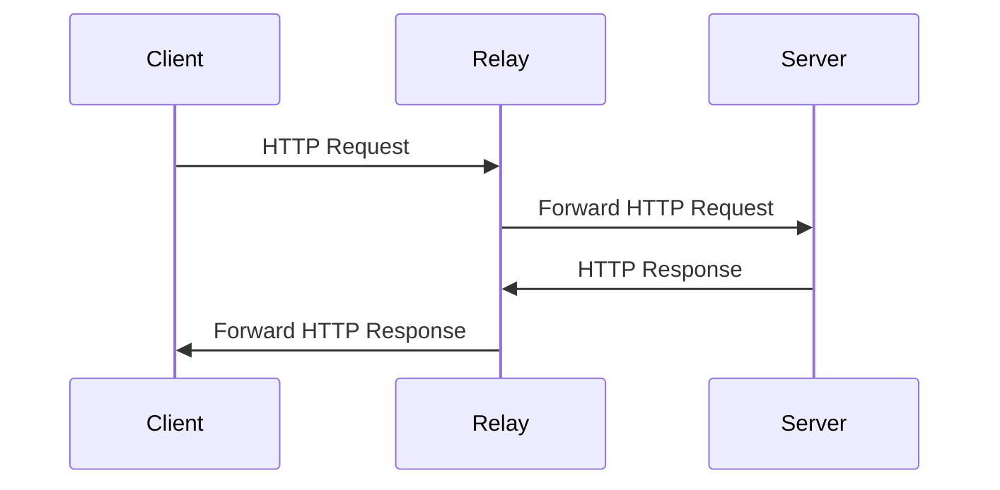

<p align="right">
   <a href="./README.md">中文</a> | <strong>English</strong>
</p>

<div align="center">

# Go Relay

_✨ Golang based HTTP relay server, easy to deploy & use ✨_

</div>

<p align="center">
  <a href="https://raw.githubusercontent.com/songquanpeng/go-relay/master/LICENSE">
    
  </a>
  <a href="https://github.com/songquanpeng/go-relay/releases/latest">
    
  </a>
  <a href="https://github.com/songquanpeng/go-relay/releases/latest">
    
  </a>
  <a href="https://hub.docker.com/repository/docker/justsong/go-relay">
    
  </a>
  <a href="https://goreportcard.com/report/github.com/songquanpeng/go-relay">
  
  </a>
</p>

## Features
+ [x] Easy to use
+ [x] Token authentication
+ [ ] Support IP whitelist

## Usage
### Server

```bash
# Initialize configuration file
./go-relay init
# Check and save the generated token
cat go-relay.yaml
# Start the server
./go-relay
```

Or deploy using Docker:

```bash
docker run -d --restart always --name go-relay -p 6872:6872 -v /home/ubuntu/data/go-relay:/app justsong/go-relay
```

### Client
When making an HTTP request, replace the host address and port in the request URL with your relay server address and port.

Then add the following fields to the request header:
1. `X-Relay-Token`: Token configured on Go Relay server
2. `X-Relay-Host`: Target address to request
3. `X-Relay-Protocol`: Request protocol, optional, defaults to https

## Flowchart

