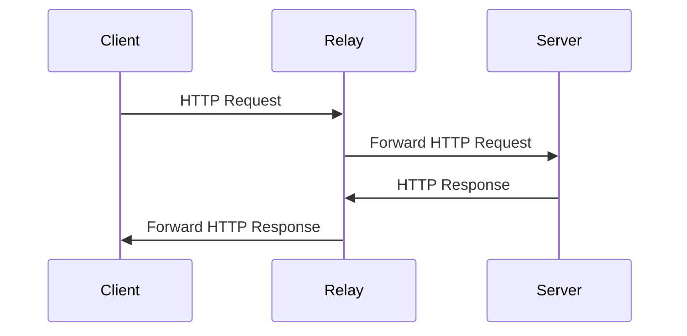

<p align="right">
   <strong>中文</strong> | <a href="./README.en.md">English</a>
</p>

<div align="center">

# Go Relay

_✨ 基于 Go 的 HTTP 中继，可用于国内服务器请求无法正常访问的 API，也可以用于搭建镜像网站，开箱即用 ✨_

</div>

<p align="center">
  <a href="https://raw.githubusercontent.com/songquanpeng/go-relay/master/LICENSE">
    
  </a>
  <a href="https://github.com/songquanpeng/go-relay/releases/latest">
    
  </a>
  <a href="https://github.com/songquanpeng/go-relay/releases/latest">
    
  </a>
  <a href="https://hub.docker.com/repository/docker/justsong/go-relay">
    
  </a>
  <a href="https://goreportcard.com/report/github.com/songquanpeng/go-relay">
  
  </a>
</p>

## 功能
+ [x] 开箱即用
+ [x] Token 认证
+ [x] 支持镜像网站
+ [x] 支持 HTTP Basic Auth
+ [ ] 支持 IP 白名单

## 用法
### 中继模式
#### 服务端

```bash
# 初始化配置文件
./go-relay init
# 检查并保存生成的令牌
cat go-relay.yaml
# 启动服务器
./go-relay
```

或者使用 Docker 进行部署：

```bash
docker run -d --restart always --name go-relay -p 6872:6872 -v /home/ubuntu/data/go-relay:/app justsong/go-relay
```

#### 客户端
进行 HTTP 请求时，将请求 URL 中的主机地址和端口替换为你的中继服务器地址和端口。

然后在请求头中添加以下字段：
1. `X-Relay-Token`：Go Relay 服务端配置的令牌
2. `X-Relay-Host`：要请求的目标地址
3. `X-Relay-Protocol`：请求协议，可选，默认为 `https`

### 镜像模式

```bash
./go-relay mirror https://www.google.com/
```

或者使用 Docker 进行部署：

```bash
docker run -d --restart always --name go-relay -p 6872:6872 -v /home/ubuntu/data/go-relay:/app justsong/go-relay mirror https://www.google.com/
```

如果你不想要任何人都能使用你的镜像站，可以在配置文件中指定 `username` 和 `password`，之后在请求时使用 HTTP Basic Auth 进行认证。

## 流程图

